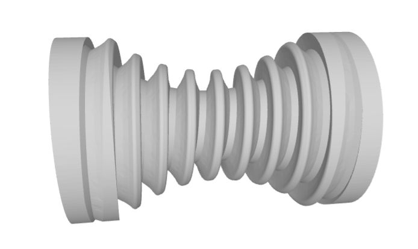

# FreeCAD-wormdrive

FreeCAD 0.20+ scripted objects Python dealing with the design of worm drives (both gear and wheel). At high tesselation (angular resolution) make take some good minutes for `FreeCAD.ActiveDocument.recompute()` to finish generating the gear and/or wheel.

## Throated worm drives
 
The worm gear looks like

